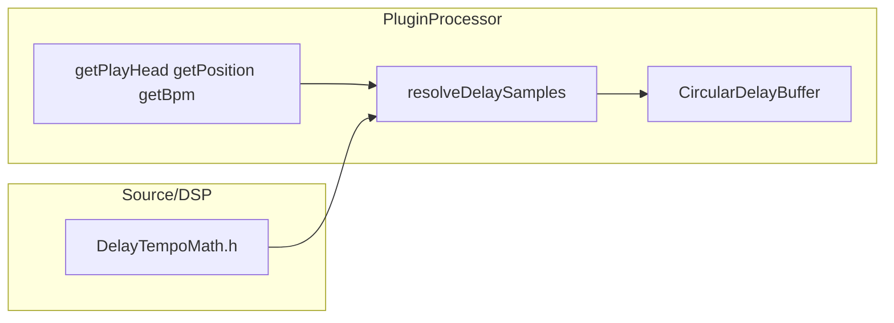

# Plano: Sincronização de tempo ao BPM do host

> **ClickUp:** [Fase 1 — Motor de Delay Básico](https://app.clickup.com/90171225448/v/l/li/901713673870) · **Entrega:** 3/5 nesta pasta  
> **Tarefa:** [Sincronização de tempo ao BPM do host](https://app.clickup.com/t/86e1b2fc1)  
> **Dependências:** [`01-configuracao-projeto-juce.md`](01-configuracao-projeto-juce.md) + [`02-buffer-circular-delay.md`](02-buffer-circular-delay.md)  

---

## Objetivo (produto)

Permitir que o usuário defina o delay em **ms** (tempo livre) ou em **sincronia com o BPM do host** (figura rítmica em batidas de semínima). Com `AudioPlayHead` e BPM válidos, o atraso em **amostras** deve seguir o tempo; sem host ou BPM inválido, o comportamento deve degradar de forma **previsível e sem NaN**.

---

## Estado atual do repositório (linha de base)

- **JUCE:** `JUCE_TAG` **8.0.12** no [`CMakeLists.txt`](../../CMakeLists.txt) (confirmar API nos headers em `build/_deps/juce-src/` após configure).
- **Delay:** [`CircularDelayBuffer`](../../Source/DSP/CircularDelayBuffer.h) + parâmetro **`delayMs`** (0–2000 ms) no APVTS; [`PluginProcessor::processBlock`](../../Source/PluginProcessor.cpp) converte ms → amostras (inteiro, sem interpolação fracionária no tap).
- **Tecto de buffer:** `maxDelayTimeSeconds = 2.0` (prepare reserva anel + margem ≥ bloco).
- **UI:** coluna central ainda placeholder; **não** é obrigatório completar sliders neste ticket — ver repartição com [`05-ui-parametros-motor-delay-basico.md`](05-ui-parametros-motor-delay-basico.md).

---

## API JUCE 8 relevante (não confiar em memória)

- `AudioProcessor::getPlayHead()` → `AudioPlayHead*` (pode ser `nullptr`).
- Método correto: **`AudioPlayHead::getPosition()`** → `juce::Optional<juce::AudioPlayHead::PositionInfo>`.
- BPM: `PositionInfo::getBpm()` → `juce::Optional<double>` — só usar se **engaged** e valor **> 0** e **finito**.
- `getCurrentPosition(CurrentPositionInfo&)` existe mas está **deprecated**; não usar em código novo.
- **Chamadas:** só desde `processBlock` (requisito da documentação JUCE).

---

## Arquitetura da entrega

- **DSP puro (sem `juce::Component`):** ficheiro novo recomendado **[`Source/DSP/DelayTempoMath.h`](../../Source/DSP/DelayTempoMath.h)** — funções **inline** / `constexpr` onde fizer sentido (`beatsToSeconds`, `secondsToSamples`, tabela de figuras em **batidas de semínima**, `delayMsToSamples`, `resolveDelaySamples`). **Sem dependência de JUCE** para facilitar testes Catch2 sem mocks de host.
- **`PluginProcessor`:** único sítio que chama `getPlayHead()`; passa `std::optional<double>` (ou equivalente) para a função de resolução; mantém-se **fachada** fina (ver [`00-convencoes-repo-ui-testes.md`](../00-convencoes-repo-ui-testes.md)).
- **CMake:** se surgir `.cpp` novo, registar em `target_sources(FractalDelay …)` como [`CircularDelayBuffer.cpp`](../../Source/DSP/CircularDelayBuffer.cpp); se ficar **header-only**, não é preciso `.cpp`.

---

## Parâmetros APVTS (este ticket)

| `ParameterID` (versão) | Tipo | Nome no host (sugestão) | Default | Notas |
|--------------------------|------|---------------------------|---------|--------|
| `delayMs`, 1 | `AudioParameterFloat` | `Delay (ms)` | 250 | Já existe; em modo **Sync** sem BPM válido serve de **fallback temporal** (mesma semântica que hoje). |
| `delaySyncMode`, 1 | `AudioParameterChoice` | `Delay sync` | índice **0** | **0 = Ms**, **1 = Sync** (rótulos curtos; evitar “Atraso” na UI se o produto mantiver “Delay”). |
| `delayDivision`, 1 | `AudioParameterChoice` | `Delay division` | índice **2** (= **1/4**) | Lista ordenada: notas retas, ponteadas, tríades (próxima seção). |

**Rótulos sugeridos:** sufixo **`d`** = ponteado (*dotted*, ex. `1/8d`); **`t`** = tríade (*triplet*, ex. `1/8t`). Na UI podes trocar por símbolos no [`05`](05-ui-parametros-motor-delay-basico.md).

**Leitura na thread de áudio:** usar `dynamic_cast<juce::AudioParameterChoice*>(apvts.getParameter(...))` + **`getIndex()`** (padrão JUCE para índice estável da escolha). Se preferires `getRawParameterValue`, validar na implementação o que o host normaliza (menos legível).

---

## Tabela de figuras (unidade = **batida = semínima**)

Índice → **duração em batidas** (quarter notes), para converter com `beatsToSeconds(beats, bpm)`.

### Fórmulas

- **Reta (simples):** valores da coluna “batidas” da tabela (1/8 = metade de 1/4, etc.).
- **Ponteado (*dotted*):** `batidas = batidasReta × 1.5` (mesmo “nome” de figura, com ponto).
- **Tríade (*triplet*):** em relação à mesma figura reta: `batidas = batidasReta × (2/3)`.

Exemplos: 1/8 reta = `0,5`; **1/8 ponteado** = `0,75`; **1/8 tríade** = `0,5 × 2/3 ≈ 0,333…`.

### Lista sugerida para `AudioParameterChoice`

| Índice | Rótulo | Batidas | Tipo |
|--------|--------|---------|------|
| 0 | 1/1 | 4.0 | reta |
| 1 | 1/2 | 2.0 | reta |
| 2 | 1/4 | 1.0 | default |
| 3 | 1/8 | 0.5 | reta |
| 4 | 1/16 | 0.25 | reta |
| 5 | 1/32 | 0.125 | reta |
| 6 | 1/64 | 0.0625 | reta |
| 7 | 1/128 | 0.03125 | reta |
| 8 | 1/2d | 3.0 | ponteado |
| 9 | 1/4d | 1.5 | ponteado |
| 10 | 1/8d | 0.75 | ponteado |
| 11 | 1/16d | 0.375 | ponteado |
| 12 | 1/32d | 0.1875 | ponteado |
| 13 | 1/2t | 1.333… | tríade |
| 14 | 1/4t | 0.666… | tríade |
| 15 | 1/8t | 0.333… | tríade |
| 16 | 1/16t | 0.166… | tríade |
| 17 | 1/32t | 0.0833… | tríade |

- **Implementação:** `std::array<double,N>` ou tabela `constexpr` em [`DelayTempoMath.h`](../../Source/DSP/DelayTempoMath.h); testes devem cobrir **pelo menos** uma linha ponteado, uma tríade e uma reta (`SubdivisionTable`).
- **Lista mais curta:** podes omitir 1/64, 1/128 e parte das variantes desde que **atualizes** índices, default e testes em conjunto.

- **Clamp:** o resultado em amostras deve respeitar `delayLine.getMaxDelaySamples()` (figuras longas a BPM baixo podem estourar o anel de 2 s — comportamento esperado: **clamp**, não crash).
- **Time signature / tempo map:** **fora** desta iteração (mantém-se o objetivo do plano alinhado a BPM global; mapa musical fino = iteração futura).

---

## `processBlock` — algoritmo recomendado

1. Ler `delaySyncMode`, `delayDivision`, `delayMs` (e índices das choices).
2. Construir `std::optional<double> hostBpm`:
   - `getPlayHead()` não nulo;
   - `getPosition()` engaged;
   - `getBpm()` engaged, `> 0`, `std::isfinite`.
3. Calcular **um** `delaySamples` por **bloco** (não por amostra — evita trabalho redundante e mantém coerência com “sem sample-accurate automation” do escopo).
4. Chamar **`resolveDelaySamples`** (ou equivalente no namespace DSP):
   - **Modo Ms (0):** igual ao atual: `round(delayMs * sr / 1000)` + clamp.
   - **Modo Sync (1):** se `hostBpm` válido → `seconds = beatsToSeconds(beatsForDivision(índice), *hostBpm)` → `secondsToSamples` + clamp; **senão** → **mesmo caminho que Ms** com `delayMs` (critério “PlayHeadAbsent” / BPM inválido).
5. Loop amostra a amostra: `readDelayed` / `pushSample` como hoje, usando o **mesmo** `delaySamples` em todo o bloco.

---

## Política de transporte / pausa (documentar no código)

- **Não** é obrigatório nesta fase tratar `getIsPlaying()` de forma especial: muitos hosts continuam a expor BPM válido com transporte parado.
- Se no futuro o eco “respirar” mal em pause, documentar aqui e no comentário no `.cpp` a decisão (ex.: congelar último BPM, ou forçar modo Ms).

---

## Suavização de `delaySamples` (opcional)

- **Fora da primeira PR** se atrasar: o plano aceita *opcional*.
- Se implementar: preferir **alvo por bloco** sem modificar a semântica do buffer sem interpolação (evita *zipper* sem `readDelayed` fracionário); ou `LinearSmoothedValue` **só** no destino em segundos com arredondamento final — avaliar audição.

---

## Testes unitários (Catch2, tag `[processor]`)

Implementar testes que **incluem só** [`DelayTempoMath.h`](../../Source/DSP/DelayTempoMath.h) (sem GUI, sem playhead):

| Nome sugerido `TEST_CASE` | O que validar |
|---------------------------|----------------|
| `BeatsToSeconds` | 1 batida a **60 BPM** ⇒ **1,0 s** (tolerância float razoável). |
| `SubdivisionTable` | Reta: semínima = **1,0**, colcheia = **0,5**; ponteado: **1/8d** = **0,75**; tríade: **1/8t** ≈ **0,333…** (conferir tabela de índices). |
| `InvalidBpmFallback` | BPM ≤ 0 ou não finito ⇒ `beatsToSeconds` **não** produz NaN; `resolveDelaySamples` em modo Sync sem BPM cai no caminho **ms** com `delayMs` conhecido. |
| `PlayHeadAbsent` | Simular `hostBpm` ausente + modo Sync ⇒ mesmo resultado que ms para o mesmo `delayMs` / `sr` / `maxDelay`. |

Atualizar o smoke **“instancia”** para verificar que `delaySyncMode` e `delayDivision` existem no APVTS.

---

## Critérios de aceite (checklist fecho ClickUp)

- [ ] Standalone / DAW com playhead: mudar BPM altera tempo de eco em **Sync** de forma audível e coerente com a figura escolhida.
- [ ] **Sem NaN** ao mudar BPM ou alternar modo (testes + sanity no `processBlock`).
- [ ] **Sem playhead** ou BPM inválido: modo **Sync** degrada para **ms** (`delayMs`) sem silêncio inesperado.
- [ ] **Clamp** respeitado vs tecto do anel (2 s + margem).
- [ ] **Build** e `FractalDelay_Tests` (`~[gui]`) verdes no fluxo do repo.

---

## Ordem de implementação sugerida

1. Adicionar [`DelayTempoMath.h`](../../Source/DSP/DelayTempoMath.h) com funções puras + `resolveDelaySamples` + comentário da política fallback.
2. Registar testes em [`Tests/FractalDelayTests.cpp`](../../Tests/FractalDelayTests.cpp) (tabela acima + smoke APVTS).
3. Estender `createParameterLayout` e `processBlock` em [`PluginProcessor.cpp`](../../Source/PluginProcessor.cpp) conforme a seção “`processBlock`”.
4. `cmake --build` + `ctest` / executável de testes.
5. **UI completa** (sliders, *attachments*, cópias de BPM na UI): [`05-ui-parametros-motor-delay-basico.md`](05-ui-parametros-motor-delay-basico.md) — pode ser PR/ticket separado se quiseres fechar o **86e1b2fc1** só com motor + testes.

---

## Fora de escopo (confirmado)

- Automação **sample-accurate** do tempo de delay.
- **Time signature** variável / **tempo map** completo do host.
- Interpolação fracionária no **tap** do `CircularDelayBuffer` (continuação do doc [`02`](02-buffer-circular-delay.md)).

**Continuação (compasso / tempo map):** *time signature*, mapa de tempo e semântica de **beat** do host (ex.: 6/8) estão planejados na Fase 2 — ver [`04-compasso-tempo-map-e-beat-host.md`](../fase-2-feedback-engine/04-compasso-tempo-map-e-beat-host.md).

---

## Riscos e mitigação

| Risco | Mitigação |
|-------|-----------|
| API `PositionInfo` / `Optional` muda entre tags JUCE | Fixar `JUCE_TAG`; encapsular leitura de BPM num único sítio no processador. |
| Parâmetros novos na UI | Seguir APVTS + validação como em [`00-convencoes-repo-ui-testes.md`](../00-convencoes-repo-ui-testes.md); ticket [`05`](05-ui-parametros-motor-delay-basico.md). |
| Figura longa + BPM baixo | Clamp documentado + lista de figuras limitada. |

---

## Próximo documento nesta pasta

[`04-modos-clean-tape.md`](04-modos-clean-tape.md)
